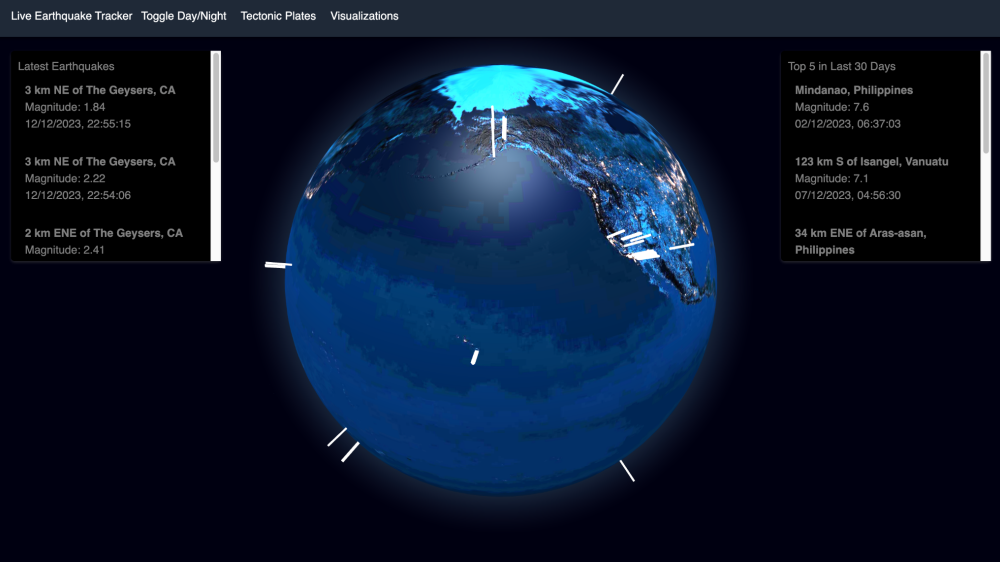

# Seismic Prediction Project

## Overview
This project utilizes big data techniques to analyze and predict seismic activities using the dataset from the US Geological Survey. Covering data from January 1, 1900, to December 7, 2023, this project employs machine learning algorithms to identify patterns and predict potential seismic events.

## Dataset
The dataset includes over 4 million records and is approximately 1.2 GB in CSV format and 3 GB in GeoJSON format. It contains detailed information about past seismic activities and is crucial for our predictive modeling.

## Technologies Used
- Apache Spark: For handling and analyzing large-scale datasets.
- RandomForestRegressor and RandomForestClassifier: Machine learning models for predicting geographic coordinates and earthquake magnitudes.

## Folder Structure
- `data/`: Contains the seismic data files.
- `src/`: Source code for the project.
  - `model_training.py`: Code for training the machine learning models.
  - `predict.py`: Code for making predictions using trained models.
- `model_selection/`: Scripts for hyper-parameter tuning of models.
  - `model_selection.py`: Hyper-parameter optimization script.

## Setup and Installation
1. Ensure Python and Apache Spark are installed on your system.
2. Install necessary Python packages:
   pip install pyspark scikit-learn pandas
3. Clone the repository:
    git clone <git@github.com:Jeevana-24/Earthquake_Prediction.git>
4. Navigate to the project directory and run the scripts:
    cd Seismic-Prediction-Project
    python src/model_training.py
5. Running the Application:Execute the prediction script to see the model's output:
    python src/predict.py
6. Results
    The models predict potential locations and magnitudes of seismic events. Results are stored in the results/ directory and include latitude, longitude, and magnitude categories of predicted seismic activities.
7. Screenshots
   
